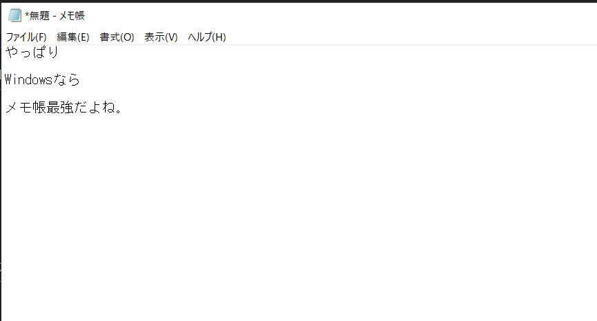

<!-- $theme: gaia -->
<!-- $size: 16:9 -->
<!-- page_number: true -->
<!-- paginate: true -->

# 吉倉劇場（ツール使いこなし）

- VS Code
- draw.io

--- 
# 自己紹介

- 吉倉 英貴（よしくら ひでき）
- 光が丘在住
- 2018年6月から参加
- 業務アプリケーション開発がお仕事
- 主にバックエンド（サーバサイドとかデータベースとか）

---

# Visual Studio Code

- テキストエディタです。
- VS Codeと呼ばれることも多い。
- Visual Studioという開発ツールとは別物です。
- Windowsだと...
    - メモ帳 →これしかないと、サーバで作業する時にいろいろ困る
    - サクラエディタ → 実行ファイル持っていけばいいので、インストール不要
    - 秀丸 → お金を出す価値はある。スーパーライセンスパックが6,380円。

- Linuxだとvi?
- Macだとメモ?

--- 

# 何が嬉しいかというと
- Markdownでドキュメントを書くので、親和性が高い。
- 画像も埋め込めるよ

--- 

# さらに嬉しいこと

- 拡張機能が豊富
    - プログラムの実行もできる
    - VS Codeがあれば十分開発できる言語もいくつか(node.jsとか)
    - このプレゼンもVS Code使ってます(marpという拡張)

---

# PagesやWord、Excelだとダメなの？
- テキストで書けるのがよい。
- 最悪、メモ帳やviでも確認できる
- PagesやWord、Excelだと、ソフトが入ってないと見れない
- gitで比較がしやすい

---

# VSCodeって開発者向けなの？
- 文章書くなら開発者でなくとも使うと便利
- Markdownはいいぞ
- `コードもかけるし`、**太字**　もできる。_斜体も_、~~打ち消しも~~
- 箇条書きも
    - こんな風に
        - 階層が作れるよ
> 引用もOK

---

表も書けるよ！

| Left align | Right align | Center align |
|:-----------|------------:|:------------:|
| This       | This        | This         |
| column     | column      | column       |
| will       | will        | will         |
| be         | be          | be           |
| left       | right       | center       |
| aligned    | aligned     | aligned      |

---

# draw.io
- 作図ツールです
- 無料で使えます
- インストールしてなくても、Web上でも動かせます
- Visioと遜色なし（の気がする）

---

# 動かしてみましょう
- Excelやパワポのお絵かきよりやりやすい
- pdf、svg,pngなど、いろんな形式で出力可能
- 出力したものをmarkdownで画像埋め込みとか。

---

# おしまい

ちょっと修正。