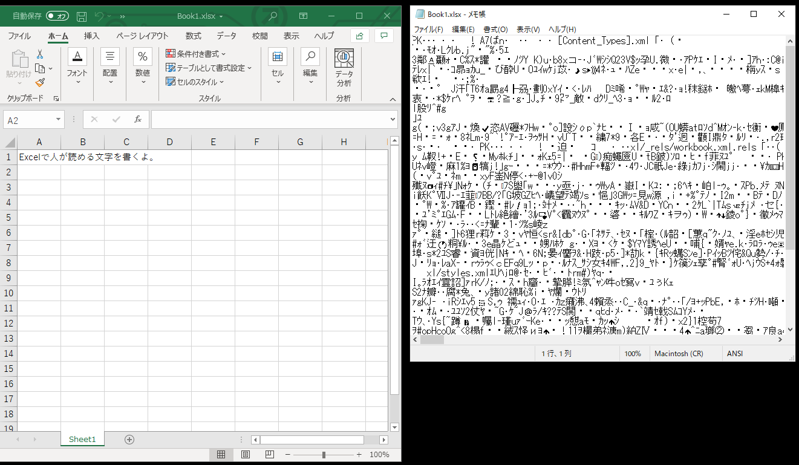
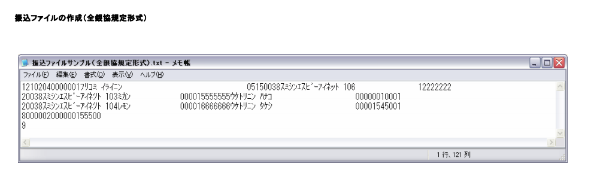

<!-- $theme: gaia -->
<!-- $size: 16:9 -->
<!-- page_number: true -->
<!-- paginate: true -->
<!-- headingDivider: 1 -->

# 吉倉劇場（ファイルの形式）

- テキストとバイナリ
- Excelはテキスト？バイナリ？
- CSVとかJSONとかXMLとか

# 自己紹介

- 吉倉 英貴（よしくら ひでき）
- 光が丘在住
- 練馬区民歴 合計13年？
    - 江古田0.5年、練馬1丁目4年、練馬4丁目6.5年、光が丘0.8年
- 2018年6月から参加
- 業務アプリケーション開発がお仕事
- 主にバックエンド（サーバサイドとかデータベースとか）

# テキストとバイナリ

- コンピュータの処理用に、データは2進数で表現される
- これはテキストもバイナリも変わらない
- 何が違うの？
    - テキストは、人間が読んで内容を理解できるデータ
    - バイナリは、コンピュータの処理用になっているデータ

# テキストデータ
- テキストエディタで開いて、読めたらテキスト。
- 読めなきゃバイナリ。
- ざっくり分けるとこんな感じ。

# テキストエディタって？
- メモ帳
- サクラエディタ
- 秀丸エディタ
- Visual Studio Code
- Vi
- Emacs
- Vim
- ・・・

# Excelは？
- バイナリです。メモ帳で開くとこうなります。

# バイナリで困ること
- 特定のソフトじゃないと読めない
    - Excel(.xlsx)はExcelやNumbersじゃないと読めない
    - そのソフトが入っていない環境だと何もできない
        - Excelの手順書を持って行ったけど、サーバにはExcelなんか入ってないので困ったこともありましたね。

- PDFもバイナリです。
- 画像もバイナリです。
- バイナリはオープンデータには向かない

# テキストをデータとして扱う場合
機械判読可能なデータであること。

- TXT
- CSV/TSV
- XML
- JSON

# TXT(固定長データ)
桁数で区切って意味を持たせる。例えば、全銀協フォーマットのデータ。(総合振込)

- 1桁目がデータ区分
- データ区分が1の時はヘッダレコードとして、2桁目から2桁が種別コード(21は総合振込)…

# CSV/TSV
- `Comma Separated Values`の略
- カンマで項目を区切る
- 区切り文字がタブだとTSV
    - `Tab Separated Values`

# CSVはExcelで読める?
- 読めます。
- が、要らぬお世話を焼いてくれます。
- 編集して保存したら痛い目見ます。

# XML
- `Extensible Markup Language` の略
- こんなやつ
    - https://ja.wikipedia.org/wiki/Extensible_Markup_Language

- 最近、みる頻度が下がってきた気がする

# JSON
- `JavaScript Object Notation`の略
- 最近の主流
    - https://ja.wikipedia.org/wiki/JavaScript_Object_Notation
- 軽いのでよい。

# おしまい。
